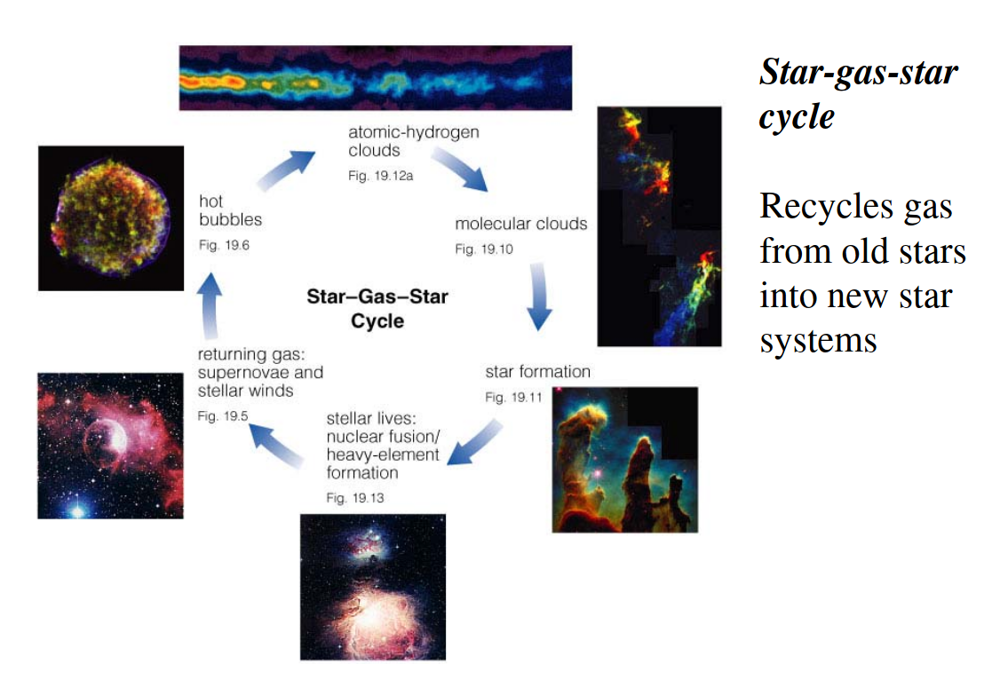

# Lecture 7: Milky Way II

## Differential rotation

Differential rotation implies that objects closer to the center take less time to complete an orbit with respect to object farther out.

This differential rotation maintains the spiral pattern in spiral galaxies and shows that stars exhibit both radial, tangential, and vertical motions.

## Galactic rotation

$$v_r=v\cos\alpha-v_0\sin\ell$$

where $v$ is the velocity of the star wrt the galactic center, $\alpha$ is the angle ... In the end we find 

$$v_r=R_0\bigg(\frac{v}{R}-\frac{v_0}{R_0}\bigg)\sin\ell$$

## Oort's constants

### The first constant: $A$

The first constant $A$ is a measure of the local shear, i.e. the deviation from the rigid rotation. $A\approx 14.8\ \text{km/s/kpc}$.

### The second constant: $B$

The tangential velocity is given as

$$v_t=v\sin\alpha-v_0\sin\ell=R_0\bigg(\frac{v}{R}-\frac{v_0}{R_0}\bigg)\cos\ell-v\frac{d}{R}$$

$B$ measures the local vorticity (the tendency of something to rotate), or the angular momentum gradient in the disk. $B\approx -12.4\ \text{km/s/kpc}$.

## Gas motion pattern

We divide the milky way into four different quadrants. In Q1 $v_r>0$ if within the sun's orbit, otherwise $v_r<0$. In QII $v_r<0$ always. In QIII and QIV we have the opposite (in terms of sign) of respectively QII and QI.

Note that any point between the galactic center and the sun will move faster than us and outside that range will be faster than us.

## Stellar streams

The distribution of stars in velocity is not smooth. Projections in $U$ and $V$ space show a lot of structure including moving groups/streams.

Those streams are groups of stars born together and/or dynamical perturbations (which could be due to a bar/spiral structure).

## MW kinematics: bulge versus halo

Stars in the halo show a nearly Schwarzschild distribution in velocities. The halo also does not appear to rotate. Stars in the halo move on very eccentric orbits, and having very large speeds implies that the stars travel very far away from the galactic center.

Kinematically, the bulge is not an extension of the halo. On top of that, stars in the bulge also have higher metallicities (closer to the disk).

## The interstellar medium

### Gas recylcing

### Dust 

Dust is responsible for [reddening](http://www.astronomy.swin.edu.au/cosmos/I/Interstellar+Reddening) and [extinction](http://burro.astr.cwru.edu/Academics/Astr221/StarProp/dust.html). 

> Dust grains in the interstellar medium have a typical size that is comparable to the wavelength of blue light. The result is that the blue light coming from distant objects is strongly absorbed and scattered by the dust, essentially removing it from the light reaching us and making the objects appear redder than they really are.

Essentially due to the dust, longer wavelengths make it through the dust clouds but _redder_, short wavelength light is scattered away from its original direction.

## The local group

- Andromeda (M31): Halo with metal-rich stars, $3/2$ times the luminosity and HI as the Milky Way.
- The Large Magellanic Cloud: About 10% as luminous as the Milky Way, it's a barred galaxy, rich in HI.
- The Small Magellanic Cloud: An irregular galaxy, rich in HI.

### Dwarf spheroidal galaxies

They are often about hundred times fainter than the SMC and LMC, rich in very old stars, and they are free of HI.
