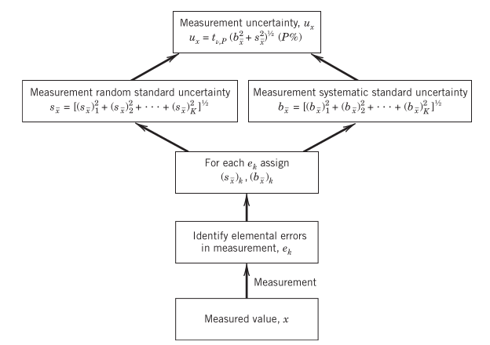

# Chapter 5

## General Definitions

Errors are effects, and uncertainties are numbers. Specifically,

- Errors are a property of the measurement: which causes a difference in the measured and true value of the population of the variable measured. They come from individual instrument calibrations, finite data set statistic, or the measurement method/approach.
- Uncertainty is a property of the result: it describes an interval about the measured value within the true value falls.

In short: the errors are *effects* and the uncertainties are *assigned numerical values*.

In uncertainty analysis we assume,

1. The test objectives are known and the measurement itself is a clearly defined process.
2. Any known corrections for systematic error have been applied to the data set, in which case the systematic uncertainty assigned to that error is the uncertainty of the correction.
3. Except where stated otherwise, we assume a normal distribution of errors and reporting of uncertainties.
4. Unless stated otherwise and for simplicity, the errors are assumed to be independent (uncorrelated) of each other.

We often begin with a _general_ analysis, in which no distinction is made between random and systematic errors. In a general analysis, we simply assign uncertainty values to errors as indicated by a value $u$. This is particularly useful when we have little information about the basis of each uncertainty value or its effect on the test outcome or are making a quick analysis perhaps to guide further test decisions.

When we have sufficient information to distinguish between systematic and random errors, so we can assign uncertainty values separately for each error, enabling a _detailed_ analysis.

## Design-Stage Uncertainty Analysis

This refers to an analysis performed early in the formulation of a test. To obtain a quick estimate of the minimum uncertainty that is expected.

The zero-order uncertainty of an instrument, $u_0$, attempts to estimate the expected variation in the measured values. As a minimum, this variation will be an amount on the level of the instrument resolution (i.e., interpolation error). Assign a numerical value to $u_0$ of either one-half of the analog instrument resolution or its digital least count. This value will reasonably represent the uncertainty interval on either side of the reading with a probability of 95%. Then,

$$u_0=\frac{1}{2}\text{resolution}=1\ \text{LSD}$$

where LSD refers to the least significant digit of the readout (its least count).

### Combining Errors

Each individual measurement error interacts with other errors to affect the overall uncertainty of a measurement. Consider a measurement of $x$ that is subject to some $K$ elements of error, each of uncertainty $u_k$, where $k=1,2\dots,K$. Then the total uncertainty can be given by,

$$u_x=\sqrt{\sum_{k=1}^K u_k^2} \ \ (P\%)$$

The RSS method of combining uncertainties is based on the assumption that the square of an uncertainty is a measure of the variance assigned to an error, and the summation of these variances yields a probable estimate of the total uncertainty.

### Design-Stage Uncertainty

We define this uncertainty by $u_d=\sqrt{u_0^2+u_c^2}$, where $u_c$ is the instrument uncertainty. Where $u_c$ is information available from the manufacturer of the instrument. Assuming a 95% probability level (i.e. a $2\sigma$ coverage), assuming that no probability level is given.

**Note**: this estimate ($u_d$) is solely used for selecting a measurement device, rather than for a final reported uncertainty.

## Error Sources

- Calibration errors: errors in the standard/reference value, instrument/system errors, calibration process errors, curve fit errors, etc.
- Data-acquisition errors: measurement operation condition errors, instrument errors, environmental effects, etc.
- Data reduction errors: curve fit errors, truncation errors, modeling errors, etc.

Again we have systematic errors and random errors:

- Systematic errors remain constant in repeated measurements under fixed conditions. We can estimate the probable range of the systematic uncertainty by the so-called *standard systematic uncertainty* $b$, such that for $\pm b$ we have $1\sigma$ coverage. The systematic uncertainty for some specific confidence level is then $t_{\nu,P}b$. For a 95% probability coverage we assume, unless otherwise states, an uncertainty $B=2b$ for $2\sigma$ coverage.
- Random errors manifest themselves in repeated measurements under fixed conditions, the effect of which can be easily observed. They are introduced through the repeatability of the measurement system components, calibration, and the measurement procedure and technique. The estimate of the probable range of a random error is assigned to a value, the *random standard uncertainty* $s_{\bar{x}}$ (at $1\sigma$ confidence). More generally we use $t_{\nu,P}s_{\bar x}$.

Note that we sometimes use the terms:

- *Type A* uncertainty: assigned based on statistical analysis of the data set.
- *Type B* uncertainty: assigned through non-statistical means.

These could both be random or systematic of nature.

## Multivariable Error Propagation

Assume we consider a result $R$ depending on $L$ independent variables,

$$R=f(x_1,x_2,\dots,x_L)$$

Each of those variables contains some measure of uncertainty that affects the result. Tee best estimate of the true mean would be,

$$R'=\bar{R}\pm u_R$$

where the sample mean of $R$ is given by,

$$\bar{R}=f(\bar{x}_1,\dots,\bar{x}_L)$$

and the uncertainty is found from,

$$u_R=f(u_{\bar{x}_1}, \dots, u_{\bar{x}_L})$$

where each uncertainty in the independent variables represents the uncertainty associated with its best estimate. The total uncertainty in $R$ is then given by the square root of the sum of the squares (RSS) of $\theta_iu_{\bar{x}_i}$ ($\theta_i=\partial R/\partial x_i|_{x=\bar{x}}$ is a sensitivity index, which is a measure of how $R$ is affected by a change in $x_i$),

$$u_R=\sqrt{\sum_{i=1}^L\bigg(\frac{\partial R}{\partial x_i}u_{\bar{x}_i}\bigg)^2}$$

Instead of via direct differentiation we can also apply dithering, applying a small perturbation to the mean and approximating the derivative. Consider a function $y=f(x)$, for $x=x_0$ we perturb the function, such that we have $y^\pm=x\pm\delta x$,

$$\frac{\partial y}{\partial x}\bigg|_{x=x_0}=\frac{y^+-y^-}{2\delta x}$$

Note that $\delta x$ should be sufficiently small. Additionally, we can use tabulated function data. 

Similarly, we can use a method called *sequential perturbation* to compute the uncertainty in a result directly via perturbations. 

1. Calculate $R_0$ based on variables under some fixed operating conditions. 
2. Increase each independent variable sequentially, to obtain perturbations $R_i^\pm=f(\dots,x_i\pm u_{x_i},\dots)$.
3. Compute, $\delta R_i^\pm=R_i^\pm-R_0$ for all $i=1,2,\dots,L$.
4. Compute,
   $$\delta R_i=\frac{\delta R_i^+-\delta R_i^-}{2}\approx \theta_i u_i$$
   Such that,
   $$u_R=\sqrt{\sum_{i=1}^L(\delta R_i)^2}$$

## Advanced-Stage Uncertainty Analysis

We consider it a method for a thorough uncertainty analysis when a large data set is not available. This is often the case in the early stages of a test program or for certain tests for which repeating measurements may not be possible. Such an advanced-stage analysis, also known as single-measurement uncertainty analysis, can be used (1) in the advanced design stage of a test to estimate the expected uncertainty beyond the initial design stage estimate and (2) to report the results of a test program that involved measurements over a range of one or more parameters but with no or relatively few repeated measurements of the pertinent variables at each test condition. Essentially, the method assesses different aspects of the main test by quantifying potential errors though various well-focused verification tests.

### Zero-Order Uncertainty $u_0$

All variables and parameters that affect the measurement are assumed to be fixed (including time), *except for the act of observation* itself. 

### Higher-Order Uncertainty

Higher-order uncertainty estimates consider the controllability of the test operating conditions and the variability of all measured variables. For example, at the first-order level, the effect of time as an extraneous variable in the measurement might be considered. A set of data (e.g. $N\ge 30$) would be obtained under some set operating condition. The first-order uncertainty of our ability to estimate the true value of a measured value could be estimated as,

$$u_1=t_{\nu,P}s_{\bar x}$$

For example, at the second level it might be appropriate to assess spatial variations that affect the outcome, such as when a value from a point measurement is assigned to quantify a larger volume.

At the $N$th-order uncertainty, instrument calibration characteristics are entered into the scheme through the instrument uncertainty $u_c$. Such that,

$$u_N=\sqrt{u_c^2+\sum_{i=1}^{N-1}u_i^2}$$

Uncertainty estimates at the $N$th order allow for the direct comparison between results of similar tests obtained either using different instruments or at different test facilities

## Multiple-Measurement Uncertainty Analysis

### Propagation of Elemental Errors

A scheme for combining multiple measurement uncertainties is depicted in the graph below.

Note that the degrees of freedom $\nu$ of respectively the *random measurement uncertainty* and final measurement uncertainty $u_x$ correspond to,

$$\nu=\frac{\bigg(\sum_{k=1}^K(s_{\bar x}^2)_k\bigg)^2}{\sum_{k=1}^K(s_{\bar x}^4)_k/\nu_k}$$

where $\nu_k=N_k-1$, and,

$$\nu=\frac{\bigg(\sum_{k=1}^K(s_{\bar x}^2)_k+(b_{\bar x}^2)_k\bigg)^2}{\sum_{k=1}^K(s_{\bar x}^4)_k/\nu_k+\sum_{k=1}^K(b_{\bar x}^4)_k/\nu_k}$$

{width=80%}

### Propagation of Uncertainty to a Result

Consider the result of some functional relationship as given by,

$$R'=\bar{R}\pm u_R$$

Note,

$$u_R=t_{\nu,P}\sqrt{b_R^2+s_R^2}$$

where,

$$s_R=\sqrt{\sum_{i=1}^L(\theta_i s_{\bar{x}_i})^2}$$

and,

$$b_R=\sqrt{\sum_{i=1}^L(\theta_i b_{x_i})^2}$$
