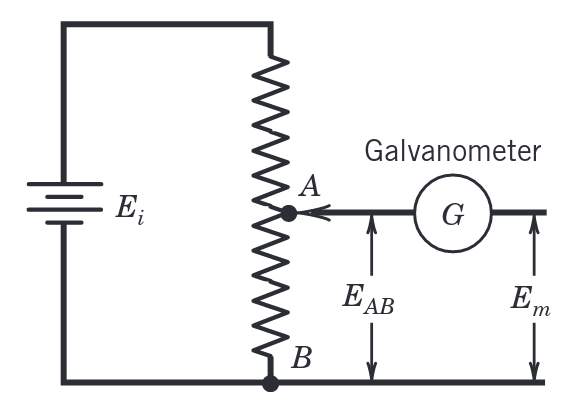
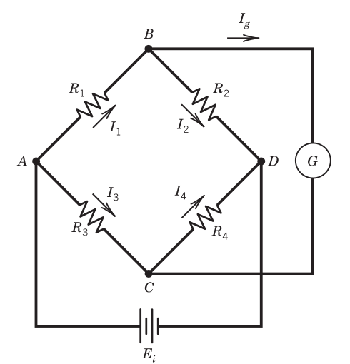

# Chapter 6

Information from electrical analog devices is often transferred in form of an electrical signal between stages of a measurement system. Analog electrical signals typically originate from measurements of a physical variable using a fundamental electromagnetic or electric phenomenon. 

Note that Kirchhoff's laws are,

$$\sum_k E_k=0\ \ \text{(around a closed loop)}$$

and,

$$\sum_k I_k=0\ \ \text{(to/from a node)}$$

## Measuring the Current

### Direct Current

A DC current is the flow of electric charge in a single direction, it is the steady state of a constant voltage circuit.

We can measure DC currents using an analog device that responds to the force exerted on a current-carrying conductor in a magnetic field.

A current loop in a magnetic field experiences a torque,

$$T_\mu=NIAB\sin\alpha$$

when the loop is not aligned with the magnetic field. Here $A$ is the cross-sectional area defined by the perimeter of the current loop and $\alpha$ the angle between the normal to the cross-sectional area of the current loop and the magnetic field.

Lot's of devices used to measure the current contain a so-called D'Arsonval movement, which employs a pointer whose deflection increases with the magnitude of the current applied. This is called a *deflection mode*.

One such sensor-transducer using this method is called a *galvanometer*, which can be used to detect a current flow in a circuit. This employs a mechanism that attempts to put the circuit into a zero current state. This is a so-called *null mode* of operation.

These devices contain hysteresis, repeatability errors, and linearity error. Along with a so-called *loading error*, which is the draining of energy from a signal being measured changing the measured signal.

### Alternating Current

AC current periodically reverses direction and changes its magnitude continuously with time.

We can measure AC currents in various ways, for instance,

- We can use a rectifier to convert the AC current to a DC current. This can be achieved via a *rectifier* (an arrangement of diodes).
- Using an *electrodynamometer*, essentially a D'Arsonval movement device but with an electromagnet instead of a permanent magnet.
- We can use a Hall effect probe, which is clamped over the current-carrying wire (conductor) to measure its unknown current. Note that the Hall effect is the voltage developed from a conductor placed perpendicular to a magnetic field. For a known current the magnitude of the voltage depends on the magnitude of the magnetic field. The Hall-effect sensor is a thin conducting semiconductor wafer driven by a known current.

## Measuring Voltages

### Analog Voltage Meters

We can measure a DC voltage through a circuit which uses a resistor placed in series with a D'Arsonval movement. This would use a certain known fixed resistor which, through Ohm's law $E=RI$, allows us to relate the D'Arsonval movement in terms of voltage.

AC voltages can be measured, similarly, through rectification or through the use of an electromagnet. Note that these instruments are sensitive to the *rms* value of the AC current, and can be calibrated in terms of the voltage.

### Oscilloscope

It is a graphical display device, generally displaying the voltage magnitude as a function of time. It is able to measure frequencies well into the GHz range.

### Potentiometer

We use a potentiometer for DC voltages in the micro to millivolt range. A potentiometer balances an unknown input voltage against a known internal voltage until both sides are equal. Thus it is a *null balance* instrument, which drives the loading error to essentially zero. Note that the *loading error* is the normalized difference between the output voltage with an infinite meter resistance and that with a finite meter resistance.

A component found in these potentiometers are *voltage divider circuits*. Resistor voltage dividers are commonly used to create reference voltages, or to reduce the magnitude of a voltage, so it can be measured. Given an input voltage $E_i$, the output voltage is,

$$E_o=\frac{R_x}{R_T}E_i$$

where $R_T$ is the total resistance and $R_x$ is a variable resistance depending on the position of the sliding contact (thus note that $R_x<R_T$).

An example of such a potentiometer based instrument might use a voltage divider and a galvanometer as shown in the figure below. It uses a *null balance* scheme, i.e. when the voltages $E_{AB}=E_m$ ($E_m$ is the measured voltage) are equal, the galvanometer does not report any current flow. Note that $E_i$ is a known supply voltage.

Note: _the current flow measured by $G$ is the result of imbalance between $E_m$ and $E_{AB}$. And with a known and constant $E_i$, the position of $A$ can be calibrated to indicate $E_m$ directly._

{width=60%}

## Resistance Measurements

### Ohmmeter Circuits

One way to measure resistance is by imposing a voltage across the unknown resistance and measuring the resulting current flow where $R=E/I$. This is the basis of common analog Ohmmeters. They tend to use a D'Arsonval mechanism with a shunt resistor, to limit the flow of current through the meter movement.

### Bridge Circuits

Bridge circuits can be used to measure capacitance ($C=Q/E$ or $I=Q\dot{E}$), inductance ($L=E/\dot{I}$), but are most often used for resistance measurements.

A common bridge circuit is the [Wheatstone bridge](http://eleceng.dit.ie/gavin/Instrument/Signal%20Cond/WB1.html) (see the figure below), where $R_1$ some sensor that experiences a change in resistance associated with a change in some physical variable.  Furthermore, a DC voltage is applied across nodes $A$ and $D$.

When no current flows through the galvanometer, $I_g=0$, we say that the bridge is in a balanced condition. This is characterized by the following systems of equations,

$$I_1R_1-I_3R_3=0$$

$$I_2R_2-I_4R_4=0$$

In that case the currents through the arms of the bridge are equal, i.e. $I_1=I_2$ and $I_3=I_4$. This implies that,

$$\frac{R_2}{R_1}=\frac{R_4}{R_3}$$

which is a necessary condition for the resistances of the balanced bridge.

This circuit can be used to measure resistance (changes) if the resistor $R_1$ varies with changes in the measured physical variable, then one of the other arms of the bridge can be adjusted to null the circuit and determine the resistance. Or we use a voltage measuring device to measure the voltage unbalance in the bridge as an indication of the change in resistance.

{width=60%}

### Null Method

Now consider the same figure, however, now with $R_2$ being a variable resistor. We adjust $R_2$ so that the bridge is balanced. Note that $R_2$ should be a calibrated variable resistor, such that any adjustments in $R_2$ directly indicate the value of $R_1$.

We can balance manually or through a closed-loop controller. Advantages of the null method are:

1. The applied input voltage need not be known, and changes in the input voltage do not affect the accuracy of the measurement. 
2. The current detector or controller need only detect if there is a flow of current, not measure its value.

### Deflection Method

In an unbalanced condition, the magnitude of the current or voltage drop for the meter portion of the bridge is a direct indication of the change in resistance in one or more of the arms.

#### Deflection Under Balanced Conditions:

If we consider a meter with infinite internal impedance (no current flow through the meter), the output voltage is given by,

$$E_o=I_1R_1-I_3R_3$$

Such that with the equations for a balanced bridge we have,

$$E_o=E_i\bigg(\frac{R_1}{R_1+R_2}-\frac{R_3}{R_3+R_4}\bigg)$$

If initially $E_o=0$ and $R_1=R_2=R_3=R_4=R$, we find that the change in output voltage is given by,

$$\frac{\delta E_o}{E_i}=\frac{\delta R/R}{4+2(\delta R/R)}$$

**Note**: that in contrast to the null method, the deflection method requires a meter capable of accurately indicating the output voltage, as well as a stable and known input voltage. The bridge should respond to any resistance changes over frequency input. Thus, it is often used for time varying signals.

#### Deflection Under Unbalanced Conditions:

We know have a current sensitive bridge. We assume that the current sensing device has a resistance $R_g$. We find that the current through the meter $I_g$ is given by,

$$I_g=\frac{E_i(R_1R_4-R_2R_3)}{R_1R_4(R_2+R_3)+R_2R_3(R_1+R_4)+R_g(R_1+R_2)(R_3+R_4)}$$

if we consider voltage drops in the path through $R_1$, $R_g$, and $R_3$. Now we have $E_o=I_gR_g$. And in terms of the bridge deflection voltage $E_o$, the change in resistance $R_1$ is found by,

$$\frac{\delta R}{R_1}=\frac{(R_3/R_1)\big[E_o/E_i+R_2/(R_2+R_4)\big]}{1-E_o/E_i-R_2/(R_2+R_4)} - 1$$

Now if we again consider all resistances initially equal, $R$, and $R_1=R+\delta R$,

$$I_g=E_i\frac{\delta R/R}{4(R+R_g)}$$

with output voltage,

$$E_o=E_i\frac{\delta R/R}{4(1+R/R_g)}$$

**Note**: in case we have a voltage source with some internal resistance $R_s$, and with the effective bridge resistance $R_B$ (see equation 6.23 in the book), we find that the input voltage is slightly different,

$$E_i=\frac{E_sR_B}{R_s+R_B}$$

In a similar manner, the bridge impedance can affect the voltage indicated by the voltage measuring device. For a voltage-measuring device of internal impedance $R_g$, the actual deflection voltage, relative to the indicated voltage ($E_m$) is,

$$E_o=\frac{E_m}{R_g}\bigg(\frac{R_1R_2}{R_1+R_2}+\frac{R_3R_4}{R_3+R_4}+R_g\bigg)$$

The difference between $E_m$and $E_o$ is a loading error, due to the bridge impedance load.

## Loading Errors & Impedance Matching

Any effect that affects the measured variable is considered a *loading* that the measurement system exerts on that variable. The *loading error* is the difference between the measurand and the indicated value. Loading occurs somewhere along the signal path. For instance *interstage loading errors* occur due to the output from one stage being affected by the subsequent stage.

### Loading Errors for Voltage-Dividers

*Consider the voltage divider in figure 6.14.* As a sliding contact moves it divides the full-scale deflection resistance $R$ into $R_1$ and $R_2$, such that the total resistance is $R_T=R_1+R_2$. The measured resistance is $R_m$, and the current flow from the voltage source is,

$$I=\frac{E_i}{R_\text{eq}}=\frac{E_i}{R_2+R_1R_m/(R_1+R_m)}$$

where $R_\text{eq}=R_2+R_L$ ($R_L$ is the equivalent resistance from the parallel resistors $R_m$ and $R_1$). Such that the output voltage is given by,

$$E_o=E_i-IR_2\quad\Rightarrow\quad \frac{E_o}{E_i}=\frac{1}{1+(R_2/R_1)(R_1/R_m+1)}$$

**Note**: if we have $R_m\rightarrow\infty$,

$$\frac{E_o}{E_i}=\frac{R_1}{R_1+R_2}$$

If we define this last expression as the true value value $(E_o/E_i)'$, then the loading error $e_I$ may be given by,

$$e_I=E_i\bigg[\bigg(\frac{E_o}{E_i}\bigg)-\bigg(\frac{E_o}{E_i}\bigg)'\bigg]$$

Thus, as $R_m\rightarrow\infty$ we have that $e_I\rightarrow 0$.

### Interstage Loading Errors

Consider a common situation in the measurement chain in which the output voltage signal from one system device provides the input signal to the following device.

An open circuit voltage $E_1$ will be present at the output terminal of device 1, with equivalent impedance $Z_1$ (*impedance extends the concept of resistance to AC circuits; note that for an ideal resistor $Z_R=R$, for a capacitor $Z_C=1/j\omega C$, and for an inductor $Z_L=j\omega L$*). Then device 2 is attached across the terminals. This is equivalent to placing an impedance $Z_m$ across the terminals. This impedance acts as a load on the first device. Such that the voltage sensed by device 2 is,

$$E_m=IZ_m=\frac{E_1}{1+Z_1/Z_m}$$

where $I$ is the current that is flowing due to placing $Z_m$ across the terminals. The voltage differs from the original voltage $E_1$, so the loading error is $e_I=E_m-E_1$. Thus to minimize the loading error, we require that the interstage measuring device has a high input impedance, $Z_m\gg Z_1$.

If the signal is current-driven, maximum current transfer between devices 1 and 2 is desirable. With the extra impedance the current measured by device 2 is,

$$I_m=\frac{E_1}{Z_1+Z_m}$$

whereas otherwise $I'=E_1/Z_1$. Such that the loading error is $e_I=I_m-I'$. So to reduce the current-driven loading error, $Z_m\ll Z_1$. When such a current loop is used, the measured voltage is,

$$E_m=I'Z_m\bigg(\frac{Z_1}{Z_1+Z_m}\bigg)$$

## Amplifiers

An amplifier scales the magnitude of an analog input signal according to,

$$E_o(t)=h\{E_i(t)\}$$

A linear scaling amplifier will have $h\{E_i(t)\}=GE_i(t)$. Amplifiers have a finite frequency response and limited input voltage range.
