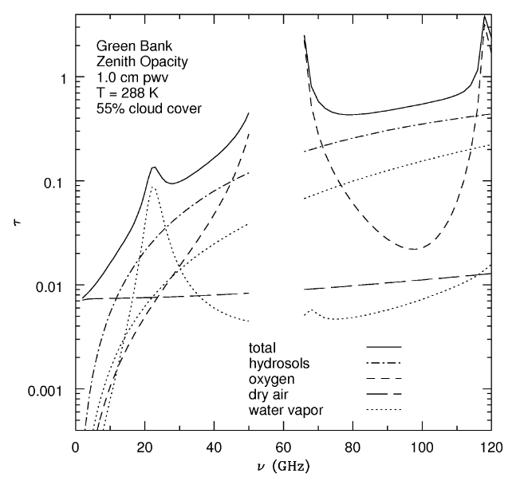

# Introduction of Radio Astronomy

# 1. Introduction

## The radio window

The radio frequency band ranges from about 10 MHz to 1 THz. Below the lower boundary charged particles in the atmosphere reflect radio waves back into space. And above the upper bound vibrational transitions of molecules absorb the radiation.

## The low-frequency cut-off

The ionosphere consists of a plasma of charged particles with an effective refractive index:

$$n^2=1-\bigg(\frac{\omega_p}{\omega}\bigg)^2$$

where $\omega_p=2\pi\nu_p$ is the plasma frequency ($\nu_p\propto \sqrt{N_e}$), defined as

$$\nu_p=\frac{\omega_p}{2\pi}=\sqrt{\frac{N_e e^2}{4\pi^2\epsilon_0 m}}$$

One can see that in the case that $\omega_p>\omega$, $n^2<1$, which implies total reflection. If $\omega_p <\omega$ there's refraction, and if $\omega_p \ll \omega$ $n^2\approx 1$. Note that this means that the observation conditions are dependent on the electron density, which is dictated by the UV photons from the solar radiation.

## The high-frequency cut-off 

### Absorption

The high-frequency cut-off is mainly due to absorption of radiation by molecules, which can also emit radiation via thermal emission.

We can define the mass absorption coefficient $k$ for some species $i$,

$$k_i=\frac{\sigma n_i}{r_i\rho_0}$$

where $\sigma$ is the collision cross-section, $n_i$ the number density of the species of particles, $r_i=\rho_i/\rho_0$ the mixing ratio, and $\rho_0$ the mass density of air. We also define the optical depth $\tau$, which is a measure of the absorption and scattering of the radiation by a medium.

$$\tau_i(\lambda, z_0)=\int_{z_0}^\infty n_i(z)\sigma\, dz=\int_{z_0}^\infty \kappa(\lambda, z)\, dz$$

where the rightmost integral is in terms of the *linear absorption coefficient* $\kappa(\lambda, z)=k_i(\lambda)\rho_i(z)$.

The attenuation of an incident ray of intensity $I_0$, received at altitude $z_0$, summed over all absorbing species is given by

$$I(z_0)=I_0\exp\bigg[-\sum_i\tau(\lambda,z_0)\bigg]=I_0\exp\big[-\tau(z)\big]$$

where $\tau(z)$ is the optical depth as a function of zenith angle. Where all absorbing species are considered together. This form of the optical depth is dependent on the path length and thus the airmass $X(z)$: $\tau(z)=\tau_0 X(z)$, where $X(z)=\sec(z)$ and $\tau_0$ is the optical depth at zenith. 

The zenith opacity varies with frequency and is a function of path length, so higher altitude and drier locations are favored. To minimize the effect of water vapor.

### Emission

The absorbing atmosphere also emits radiation in the radio part of the EM spectrum. This noise we characterize by the system noise (which is defined as an equivalent noise temperature $T_\text{sys}$), via $P=kT\Delta\nu$. Or per unit bandwidth or frequency element $P_\nu=kT_\text{sys}$. The system noise depends on the CMB, atmospheric emissions, ground emissions, receiver losses, injected noise, and receiver noise. Generally the receiver noise $T_\text{rx}$ dominates.

The contribution from the sky opacity to the atmospheric noise $T_\text{sky}$ is 

$$T_\text{sky}=T_\text{atm}\big[1-\exp(-\tau_\nu)\big]$$

where $T_\text{atm}$ is the atmospheric kinetic temperature. To minimize this noise, we want to observe in cold and dry places.

## Early radio astronomy

The spectral brightness $B_\nu$ at frequency $\nu$ of a blackbody object is given by

$$B_\nu(T)=\frac{2h\nu^3}{c^2}\frac{1}{\exp(h\nu/kT)-1}$$

which is Planck's law. In the low frequency regime ($h\nu/kT\ll 1$), using the Taylor expansion of the exponential, we obtain the Rayleigh-Jeans approximation:

$$B_\nu\approx\frac{2kT\nu^2}{c^2}$$

We can then define the flux-density $S_\nu$ as the power received per unit area per unit frequency. If the celestial source subtends a small angle $\Omega\ll 1$, 

$$S_\nu\approx B_\nu\Omega$$

where the solid angle subtended by a source, with area $A$ (e.g. $A=\pi\times\text{radius}^2$ for a spherical source) at a distance $d$, is defined as

$$\Omega=\frac{A}{d^2}$$

Note that these radio sources can be thermal and non-thermal (e.g. accelerated electron) in origin.

## Radio Telescopes and interferometers

The surface accuracy of a radio telescope is proportional to $\lambda/16$, meaning that if the surface of the dish can have bumps/inaccuracies in the surface of that order, without is affecting the quality of the data. 

Note that large single-element radio telescopes can be constructed relatively cheaply, but these will have limited spacial resolution. Given that $\theta\approx \lambda/D$. 

Interferometric techniques have been developed to combine several single-element telescopes into a multi-element array. The resolution is now limited by the distance $d$ between the dishes, $\theta\approx\lambda/d$. Using this method, the highest possible angular resolution observations (in astronomy) are made.
